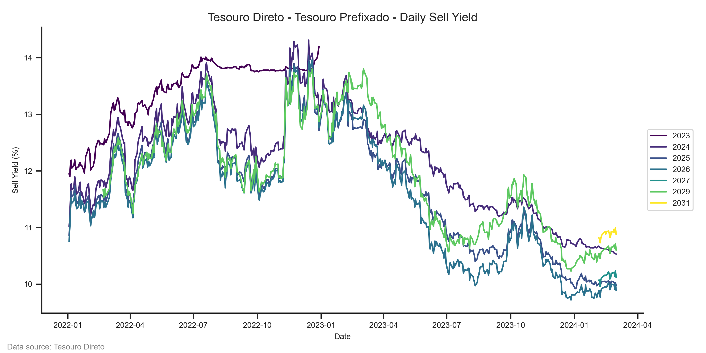

# tddata - easly download & read brazilian Tesouro Direto's data


tddata is a simple Python package to download and read Brazil's bonds data from Tesouro Direto program.

## 1. Install

To install the package, you can use pip:

```shell
pip install git+https://github.com/dankkom/tddata#egg=tddata
```

Note that this package is not available on PyPI yet. You can install it directly from the GitHub repository, needing Git installed on your machine.

## 2. Usage

### 2.1 The `tddata` CLI

This package comes with a Command - Line Interface(CLI) that makes downloading Tesouro Direto's data easier.

The syntax is as follows:

```
tddata {bond_name} {year} [-o | --output | --data-dir OUTPUT/DIRECTORY/PATH]
```

### 2.2 The `tddata` Python package

Import the package with:

```python
import tddata
```

Before you start to work the data, you need to download it to your local machine.

```python
# Download Tesouro Direto's data and save at ./data/td/
# The file is saved with the following name pattern: tesouro-direto_{last_modified:%Y%m%d%H%M}.csv
tddata.downloader.download(dest_path="./data/")
```

Now you can read the data.

You can use `read_file()` to read:

```python
# Read data file
data = tddata.reader.read_file("~/data/tesouro-direto_202403021021.csv")
```

## 3. Example

In the example below we plot the daily yields of LTN bonds from 2022-01-01 to the latest date available in the data.

```python
import matplotlib.pyplot as plt
import seaborn as sns

import tddata


data = tddata.reader.read("data/tesouro-direto_202403021021.csv")

# Filter data by date and create a new column with the bond's year of maturity
ltn = data[data["bond_name"] == "Tesouro Prefixado"]
ltn = ltn[ltn["reference_date"] >= "2022-01-01"]
ltn = ltn.assign(
    maturity_year=ltn["reference_date"].dt.year,
)

# Now plot the data with matplotlib and seaborn

# Set the style of the plot
sns.set_theme(style="ticks")
plt.rcParams["axes.labelsize"] = 8
plt.rcParams["axes.titlesize"] = 12
plt.rcParams["xtick.labelsize"] = 8
plt.rcParams["ytick.labelsize"] = 8
plt.rcParams["legend.fontsize"] = 8

# With the hue argument we plot each year of maturity by a diferent lines and colors
bond_type = "Tesouro Prefixado"
f, ax = plt.subplots(figsize=(10, 5))
sns.lineplot(
    data=data[data["bond_type"] == bond_type],
    x="reference_date",
    y="sell_yield",
    hue="maturity_year",
    estimator=None,
    ax=ax,
    palette="viridis",
    legend="full",
    linewidth=1.5,
)
ax.set_title(f"Tesouro Direto - {bond_type} - Daily Sell Yield")
ax.set_xlabel("Date")
ax.set_ylabel("Sell Yield (%)")
# Legend position
ax.legend(loc="center left", bbox_to_anchor=(1, 0.5))
# Grid off
sns.despine(ax=ax)
f.tight_layout()
# Add text with the data source at the bottom left of the figure
plt.figtext(
    0.01,
    0.01,
    "Data source: Tesouro Direto",
    horizontalalignment="left",
    fontsize=8,
    color="gray",
)
plt.show()
```



## 4. License

This project is licensed under the MIT License.

See LICENSE to see the full text.

---

Data Source: all data are downloaded from [Tesouro Transparente/Secretaria do Tesouro Nacional](https://www.tesourotransparente.gov.br/ckan/dataset/taxas-dos-titulos-ofertados-pelo-tesouro-direto/resource/796d2059-14e9-44e3-80c9-2d9e30b405c1).
