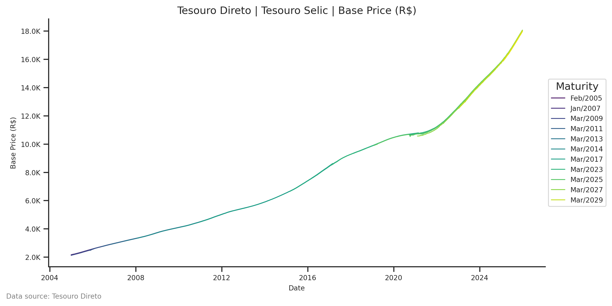
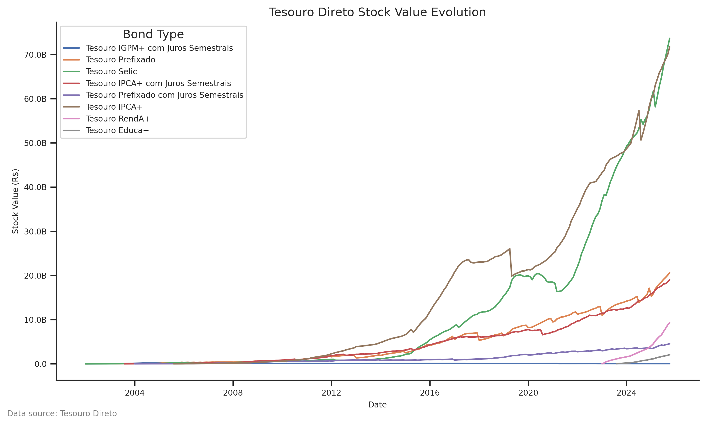
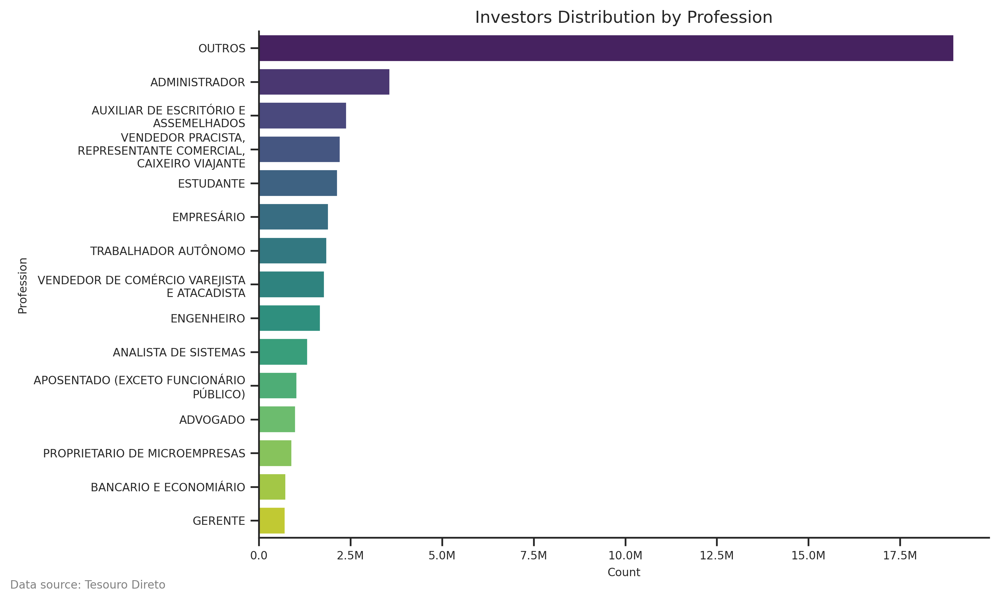

# tddata - Download, Analyze & Plot Brazilian Tesouro Direto's Data (CKAN API)


**tddata** is a powerful Python package designed to simplify the process of downloading, reading, and visualizing historical data from Brazil's Tesouro Direto program. It leverages the official CKAN API (Tesouro Transparente) to fetch the most up-to-date datasets.

## Features

*   **Automated Downloads**: Easily fetch datasets directly from the Government's CKAN API.
*   **Specialized Readers**: Dedicated functions to read and parse CSVs for Prices, Stock, Investors, Operations, Sales, Buybacks/Redemptions, and more.
*   **Standardized Data**: All DataFrames come with consistent, analyst-friendly column names defined in a robust schema.
*   **Visualization**: Built-in plotting module to generate beautiful time-series, distribution, and demographic charts using Matplotlib and Seaborn.
*   **CLI**: A convenient command-line interface for quick data fetching.

## 1. Installation

This package is currently available via GitHub. You can install it using `pip`:

```shell
pip install "git+https://github.com/dankkom/tddata#egg=tddata"
```

## 2. Usage

### 2.1 The `tddata` CLI

The package includes a Command-Line Interface (CLI) to download datasets quickly.

**Syntax:**

```bash
tddata [DATASET_ID] [-o OUTPUT_DIR]
```

**Examples:**

```bash
# Download prices/rates
tddata prices -o ./data

# Download stock (estoque) data
tddata stock -o ./data

# Download investors data
tddata investors -o ./data
```

Available datasets: `prices`, `stock`, `investors`, `operations`, `sales`, `buybacks`, `maturities`.

### 2.2 The `tddata` Python Package

You can use `tddata` as a library in your Python scripts or Jupyter Notebooks.

#### Downloading Data

```python
from pathlib import Path
from tddata import downloader

# Download 'prices' dataset to ./data folder
downloader.download(
    dest_dir=Path("./data"),
    dataset_id="taxas-dos-titulos-ofertados-pelo-tesouro-direto",
)
```

#### Reading Data

The `tddata.reader` module provides specialized functions for each dataset type.

```python
from pathlib import Path
from tddata import reader

# Read Prices/Rates
df_prices = reader.read_prices(
    Path(
        ".", "data",
        "taxas-dos-titulos-ofertados-pelo-tesouro-direto@20251230T102010.csv"
    )
)

# Read Stock
df_stock = reader.read_stock(
    Path(
        ".", "data",
        "estoque-do-tesouro-direto@20251201T102018.csv"
    )
)

# Read Investors
df_investors = reader.read_investors(
    Path(
        ".", "data",
        "investidores-do-tesouro-direto-de-2024@20251205T131939.csv"
    )
)
```

#### Plotting Data

The `tddata.plot` module makes visualization easy.

```python
import matplotlib.pyplot as plt
from tddata import plot
from tddata.constants import Column

# 1. Plot Price History
fig1 = plot.plot_prices(df_prices, bond_type="Tesouro Selic", variable=Column.BASE_PRICE.value)
fig1.show()

# 2. Plot Stock Evolution by Bond Type
fig2 = plot.plot_stock(df_stock, by_bond_type=True)
fig2.show()

# 3. Plot Investor Demographics (e.g., Population Pyramid)
fig3 = plot.plot_investors_population_pyramid(df_investors)
fig3.show()

# 4. Plot Investor Demographics (e.g., Profession Horizontal Bar)
fig4 = plot.plot_investors_demographics(
    df_investors,
    column=Column.PROFESSION.value,
    chart_type="barh",
)
fig4.show()
```








See more visualizations in the [PLOTS.md](./PLOTS.md) file.

## 3. Data Source

All data is fetched from the official **Tesouro Transparente** via their [CKAN API](https://www.tesourotransparente.gov.br/ckan/).

*   **Prices**: `taxas-dos-titulos-ofertados-pelo-tesouro-direto`
*   **Stock**: `estoque-do-tesouro-direto`
*   **Investors**: `investidores-do-tesouro-direto`
*   **Operations**: `operacoes-do-tesouro-direto`
*   **Sales**: `vendas-do-tesouro-direto`
*   **Buybacks**: `recompras-do-tesouro-direto`

## 4. License

This project is licensed under the GNU General Public License v3.0 (GPL-3.0).
